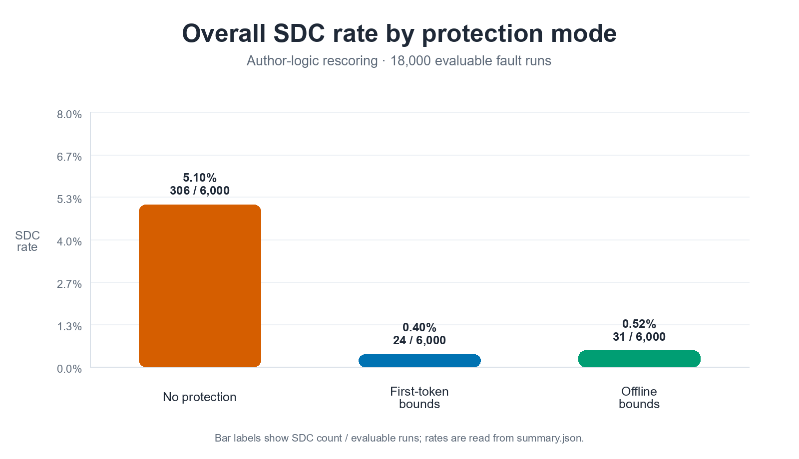
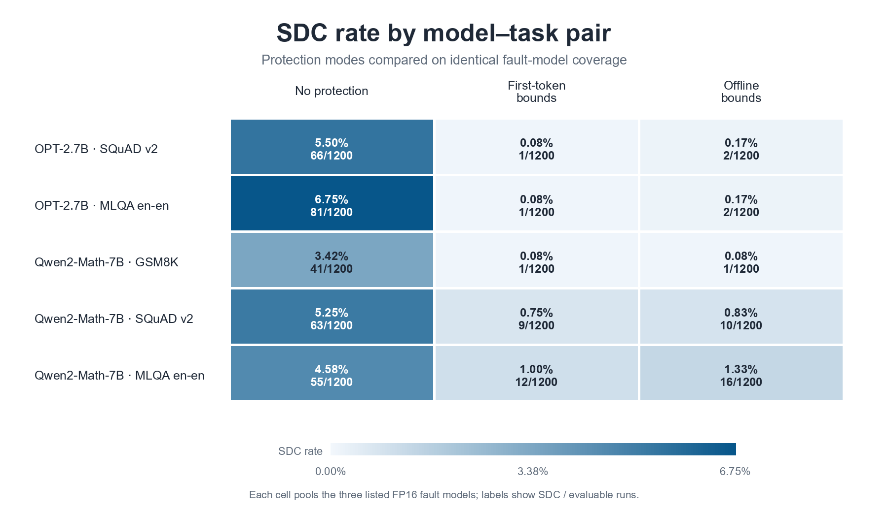
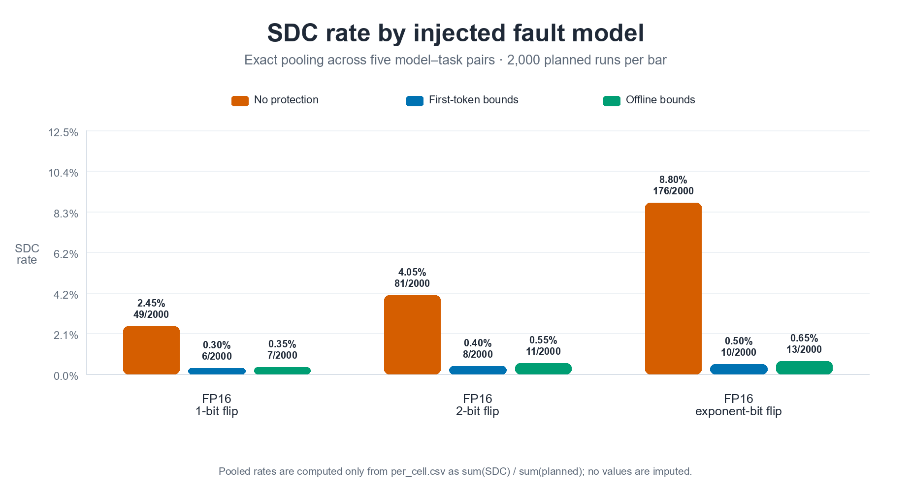
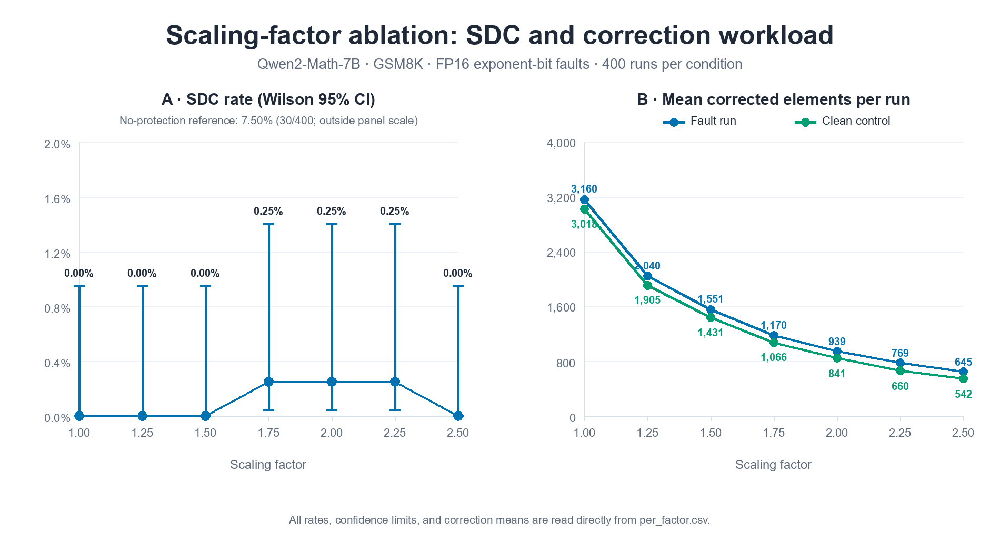
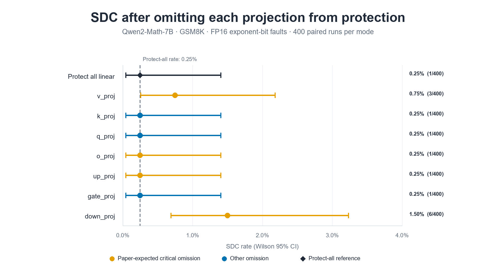

# FT2：面向生成式大模型关键层的首 Token 在线容错复现实验报告

> 复现对象：Sun 等，*FT2: First-Token-Inspired Online Fault Tolerance on Critical Layers for Generative Large Language Models*（HPDC 2025）  
> 论文：<https://doi.org/10.1145/3731545.3731570>  
> 作者代码：<https://github.com/pipijing13/FT2-LLM-inference-protection/tree/90510aec5d26850739cf583c97c65cbd71256cb1>

## 结论摘要

本次在单张 RTX 4090 上完成三组实验：18,000 次故障推理的主实验、不同 scaling factor 的消融、逐投影关键层识别。主实验按作者意图重新评分后，无保护、首 token bounds FT2、offline bounds 的 SDC 分别为 **306/6000（5.10%）**、**24/6000（0.40%）**、**31/6000（0.5167%）**。首 token FT2 相对无保护降低 **92.16%**，与论文报告的平均降低 92.92% 在方向和量级上一致。

本复现不能证明 offline 比首 token 更差。两者只差 7 个 SDC，95% Wilson 区间重叠；而且本次 offline 仅用每个模型–数据集对 **200 个校准样本**，不是论文的训练集 20%。更合理的结论是：在当前小规模、固定故障清单上，两种 bounds 的 SDC 均进入 0.5% 左右，差异不足以支持机制排序。

Scaling factor 从 1.0 到 2.5 时，受保护条件均只有 0–1/400 个 SDC，配对检验相对 factor 2.0 均为 p=1.0。低 factor 会大量裁剪正常激活；综合可靠性和非必要裁剪，仍推荐论文默认的 **factor=2.0**。

关键层 omission 实验对 **DOWN_PROJ** 给出最强方向性证据（放开后由 1/400 升至 6/400，McNemar p=0.0625），对 **V_PROJ** 给出较弱方向性证据（升至 3/400）；K/Q/GATE 的结果符合非关键层预期。O/UP 在当前样本中未出现风险增量，因此“没有验证到”而不是“证明不关键”。

## 1. 环境配置

### 1.1 论文环境与本复现环境

| 项目 | 论文默认设置 | 主实验实际设置 | Scaling / 关键层补充实验 |
|---|---|---|---|
| GPU | NVIDIA A100；另在 GH200-H100 验证硬件敏感性 | NVIDIA GeForce RTX 4090 24 GB，compute capability 8.9 | 同一 RTX 4090 |
| OS | Rocky Linux 8.10；H100 为 Rocky Linux 9.3 | Ubuntu 22.04.5 LTS，Linux 5.15，glibc 2.35 | 同服务器 |
| Driver | 论文未给精确版本 | 550.142 | 550.142 |
| Python | 未给精确版本 | 3.10.21 | 3.12.8（运行时检查） |
| PyTorch / CUDA | 未给精确版本 | 2.3.0+cu118 / toolkit 11.8 | 2.5.1+cu124 / runtime 12.4 |
| Transformers | 未给精确版本 | 4.42.4 | 4.49.0；启用 generation 兼容 wrapper |
| Datasets / NumPy | 未给精确版本 | 2.15.0 / 1.26.2 | 3.3.2 / 1.26.4 |
| 数值类型 | FP16 为主，另做 FP32 敏感性 | FP16 | FP16 |

主实验的完整运行时快照在 [`campaign.json`](results/raw/main_18k_v1/campaign.json)。补充实验环境与主实验不完全相同，因此主实验、scaling 和关键层结果只在各自协议内比较；不能把微小跨实验差异解释为算法变化。

### 1.2 固定的模型与数据版本

| 模型/数据 | 固定版本 | 本次使用范围 |
|---|---|---|
| `facebook/opt-2.7b` | `905a4b602cda5c501f1b3a2650a4152680238254` | SQuAD 2.0、XTREME MLQA en-en |
| `Qwen/Qwen2-Math-7B` | `47a44ff4136da8960adbab02b2326787086bcf6c` | SQuAD 2.0、MLQA en-en、GSM8K |
| `rajpurkar/squad_v2` | `3ffb306f725f7d2ce8394bc1873b24868140c412` | validation；offline 用 train |
| `google/xtreme`, `MLQA.en.en` | `ec5f1f46e9af79639a90684a7a70a956c4998f04` | validation；offline 用 test |
| `openai/gsm8k`, `main` | `740312add88f781978c0658806c59bc2815b9866` | test；offline 用 train |

注意：论文正文常写 Qwen2-7B，而作者 GSM8K 脚本实际加载 Qwen2-Math-7B；本复现采用后者，并在所有 artifact 中显式记录，避免把数学特化模型误写为通用 Qwen2-7B。

### 1.3 可复现控制

- 全局种子为 `196`；每个故障规格再用“SHA-256 前 128 bit → NumPy PCG64”派生独立随机流。
- Batch size=1，输入左侧 padding 到 1024 token，FP16，贪心解码。
- SQuAD/MLQA 固定生成 60 token，GSM8K 固定生成 180 token，不因 EOS 提前终止。
- 模型、数据、作者 qid/step 文件、配置、selection 和 manifest 均记录 SHA-256。
- 每种保护模式使用完全相同的 fault manifest，便于成对比较。
- 每个 inference 只允许一次经验证的 FP16 XOR；hook 次数、位级 Hamming distance、target step、shape 和 site 均由 audit 检查。

## 2. 核心算法

### 2.1 关键层识别

论文的结构性启发式为：若某线性层输出到下一线性层之间**没有 scaling 操作或激活函数**，则该层视为关键层。其直觉是，缩放或激活可能压低异常值或改变 NaN 传播；缺少这些缓冲时，异常更容易直接进入下一矩阵乘。

| 模型结构 | 关键、需要保护 | 非关键对照 |
|---|---|---|
| OPT-2.7B，32 blocks | `v_proj`、`out_proj`、`fc2`，共 96 sites | `k_proj`、`q_proj`、`fc1` |
| Qwen2-Math-7B，28 blocks | `v_proj`、`o_proj`、`up_proj`、`down_proj`，共 112 sites | `k_proj`、`q_proj`、`gate_proj` |

映射由 [`adapters.py`](code/reproduction/src/ft2_formal/adapters.py) 固定，并在加载时断言模型层数、site 数与 FP16 dtype。

### 2.2 首 token bounds 与后续 token 复用

对关键 site (i)，第 0 个生成步完成线性层计算后记录激活张量的最小/最大值：

\[
m_i=\min A_i^{(0)},\quad M_i=\max A_i^{(0)},\quad
L_i=s\,m_i,\quad U_i=s\,M_i.
\]

其中 (s) 为 scaling factor，本实验默认 (s=2.0)。第一步尚没有历史 bounds，所以只做 NaN→0；从第 1 个生成步开始复用同一组 \([L_i,U_i]\)。每次新 inference 都重新采集并清空，不能跨输入复用。

该实现位于 [`engine.py`](code/reproduction/src/ft2_formal/engine.py)。论文和代码仓库在纠错语义上存在差异：论文写“裁剪到上下边界”，作者仓库部分 CUDA 路径把越界值置零。本报告主结果采用论文 `paper_clamp`；仓库置零语义不混入主表。

### 2.3 异常检测与纠错

对后续激活值 (x)：

\[
\operatorname{FT2}(x)=
\begin{cases}
0, & x=\mathrm{NaN},\\
L_i, & x<L_i,\\
U_i, & x>U_i,\\
x, & \text{otherwise}.
\end{cases}
\]

`correction_elements` 统计执行 NaN 修正或边界裁剪的元素数；“故障检测率”定义为一次运行中该计数大于 0 的比例。它不是“成功保护率”：大量故障本来就会被模型自然掩蔽，而 tight bounds 也可能裁剪无故障激活。

### 2.4 故障注入

故障注入点是 decoder block 内线性层的 FP16 激活输出。层号均匀采样；投影按作者代码的输出宽度权重采样；序列位置和输出 feature 均匀采样。Qwen 的投影权重为 V:K:Q:O:UP:GATE:DOWN=`1:1:7:7:37:37:37`，因此 grouped-query attention 下 K/V 的直接故障数较少。

三种故障模型为：

- **1-bit**：在同一 FP16 标量的 bit 0–15 中均匀翻转 1 位。
- **2-bit**：在 bit 0–15 中无放回抽取 2 个不同位置，并对同一标量执行两次 XOR。
- **EXP**：在 FP16 exponent bit 10–14 中均匀翻转 1 位。

每次 inference 只注入一个 fault。目标 step 来自作者发布的 step 文件且主实验强制 step≥1，避免把“首 token 本身受损”和“用首 token bounds 保护后续 token”混为同一主问题。manifest 生成逻辑见 [`manifest.py`](code/reproduction/src/ft2_formal/manifest.py)。

### 2.5 Masked / SDC 判定

论文把故障结果分为：与同模式无故障输出完全相同的 `MASKED_IDENTICAL`；文本不同但任务答案仍正确的 `MASKED_SEMANTIC`；任务错误的 `SDC`。

本报告按作者脚本的实际评分意图处理：取第一条 reference，使用作者的 QA/GSM8K normalization，归一化 reference-token recall=1 判任务正确。完全相同以故障输出和**同保护模式** clean 输出的 decoded text 比较。所有 18,000 次完成运行都进入分母，不设置额外 clean-evaluability gate。

最初流水线曾将 240 个 Qwen/GSM8K first-token 运行标为 `NON_EVALUABLE_CLEAN_FAILURE`；作者逻辑重评分后其中 228 个为 identical masked、12 个为 semantic masked，且对应 clean controls 为 10/10 正确。另因作者源码中 recall<1 分支写成 `re2 == 0`，`1-mean recall` 只保留作次级连续代理，不能代替二元 SDC。重评分脚本见 [`reanalyze_author_logic.py`](code/reproduction/analysis/reanalyze_author_logic.py)。

## 3. 完整实验

三组实验合计实际执行 **23,890 次 GPU inference**：主实验 18,000 faults+150 controls，scaling 新增 2,400 faults+60 controls，关键层实验 3,200 faults+80 controls。Scaling 表中的无保护与 factor 2.0 直接复用主实验同一批 artifacts，因此统计表的逻辑规模大于新增执行量，但没有重复计入实际 GPU 次数。

### 3.1 实验一：主 SDC campaign

实际规模为：

\[
5\text{ 模型–任务对}\times10\text{ prompts}\times3\text{ 故障}\times40\text{ trials}\times3\text{ 模式}=18{,}000.
\]

另有 5×10×3=150 次 clean controls。三种模式为无保护、first-token bounds+paper clamp、offline bounds+paper clamp，后两者均用 factor 2.0。每个模型–任务对保存 1200 个唯一 fault specs，三种模式成对复用。

论文的主规模是 50 个共同答对的输入、每输入 500 次故障注入，累计超过 1100 万次 FI 和约 8000 GPU 小时。本次 4090 缩减为每格 400 次，最小非零分辨率为 0.25 个百分点；它适合验证大幅改善，不足以稳定排序 0.1% 量级的差异。

Offline comparator 由每个模型–任务对 200 个、与评估集不重合的校准样本求所有关键 site 的 global extrema。论文使用训练集 20%；作者 release 没有完整原始 offline profiler/bounds，因此这里属于预算约束下的 `reproduction_defined` 设置。

### 3.2 实验二：scaling factor

模型/任务固定为 Qwen2-Math-7B/GSM8K，故障固定为同一组 400 个 EXP specs。比较 factor 1.00、1.25、1.50、1.75、2.00、2.25、2.50，并引用同组无保护结果。逻辑规模为 3200 次故障+80 controls；无保护和 factor 2.0 复用主实验，实际新增 2400 次故障+60 controls，约 6.82 小时。

### 3.3 实验三：关键层识别

按论文 Section 4.1 的 omission 逻辑：以“所有线性层均保护”为对照，然后依次放开 V、K、Q、O、UP、GATE、DOWN 中的一类，其他线性层仍保护；故障仍可落在所有线性层。模型/任务为 Qwen2-Math-7B/GSM8K，采用 factor 2.0、同一组 400 个 EXP specs。8 个模式共 3200 次故障+80 controls，耗时约 11 小时 46 分。

这不是论文 Figure 6 的 GPT-J-6B/SQuAD 逐点复现，而是相同识别方法在服务器已有 Qwen/GSM8K 条件上的结构对应实验。

## 4. 结果分析

### 4.1 主结果：FT2 显著降低 SDC

| 模式 | Masked identical | Masked semantic | SDC | SDC rate | 相对无保护降低 |
|---|---:|---:|---:|---:|---:|
| 无保护 | 5266 | 428 | 306/6000 | 5.1000% | — |
| First-token bounds | 5577 | 399 | 24/6000 | 0.4000% | 92.16% |
| Offline bounds | 5642 | 327 | 31/6000 | 0.5167% | 89.87% |

Wilson 95% 区间分别为无保护 4.5715%–5.6860%、first-token 0.2690%–0.5945%、offline 0.3642%–0.7324%。两种保护方式都与无保护清楚分离；两种保护方式彼此区间重叠。

| 模型–任务 | 无保护 | First-token | Offline |
|---|---:|---:|---:|
| OPT-2.7B / SQuAD 2.0 | 66/1200=5.50% | 1/1200=0.083% | 2/1200=0.167% |
| OPT-2.7B / MLQA en-en | 81/1200=6.75% | 1/1200=0.083% | 2/1200=0.167% |
| Qwen2-Math-7B / GSM8K | 41/1200=3.417% | 1/1200=0.083% | 1/1200=0.083% |
| Qwen2-Math-7B / SQuAD 2.0 | 63/1200=5.25% | 9/1200=0.75% | 10/1200=0.833% |
| Qwen2-Math-7B / MLQA en-en | 55/1200=4.583% | 12/1200=1.00% | 16/1200=1.333% |

Qwen 在两个 QA 任务上的受保护残余 SDC 高于其 GSM8K，也高于 OPT QA；这说明跨任务模型适配和输出评分会显著影响汇总值，不能把“7B 参数规模”当作唯一解释变量。

### 4.2 三类故障模型

| 故障 | 无保护 | First-token | Offline |
|---|---:|---:|---:|
| FP16 1-bit | 49/2000=2.45% | 6/2000=0.30% | 7/2000=0.35% |
| FP16 2-bit | 81/2000=4.05% | 8/2000=0.40% | 11/2000=0.55% |
| FP16 EXP | 176/2000=8.80% | 10/2000=0.50% | 13/2000=0.65% |

EXP 最危险、普通 1-bit 最容易被掩蔽，与论文定性结论一致。FT2 对三类故障均有效，而不是只对极端 exponent fault 有效。

### 4.3 First-token 与 offline 为何和论文的细排序不一致

论文报告跨全部 benchmark 的 offline SDC 为 0.204%，first-token 为 0.25%，二者接近且 offline 略低。本复现为 0.5167% 与 0.40%，顺序反转，但应作以下解释：

1. **只有 7 个事件的差异。** 31/6000 与 24/6000 的绝对差为 0.1167 个百分点，Wilson 区间重叠；没有完整配对转移表时不能声称差异显著。
2. **Offline 校准规模不等价。** 论文使用训练集 20%，本次每个模型–任务对只有 200 个样本。global extrema 对覆盖范围和异常样本敏感，缩小校准集可能使部分 bounds 偏窄，也可能被少量极端值拉宽。
3. **评估子集不同。** 论文覆盖 7 个模型和更大输入集；本次只有 2 个模型、5 个 pair，且 Qwen 使用 Math 变体。
4. **故障分布不同。** 本次固定 400 faults/格、target step≥1、按输出宽度加权并跨模式配对；论文是更大规模随机 campaign。
5. **硬件和软件不同。** A100 与 RTX 4090、不同 PyTorch/Transformers kernel 可能改变激活取值和边界命中，尤其在极低 SDC 区域。
6. **评分口径经过修正。** 本报告消除了额外 clean gate，并把作者源码的 recall 语义转为二元 SDC；这比原始复现汇总更接近论文意图，但仍不是人工语义判定。

因此实验支持论文的核心主张“在线首 token bounds 与昂贵 offline bounds 效果相近”，不支持“offline 在任何缩减子集上都必须数值更低”。

### 4.4 Scaling factor 与首 token 边界效应

| Factor | SDC | Wilson 95% CI | 检测率 | 故障运行平均纠错元素 | Clean 平均纠错元素 |
|---:|---:|---:|---:|---:|---:|
| 1.00 | 0/400 | 0–0.95% | 16.00% | 3159.57 | 3017.8 |
| 1.25 | 0/400 | 0–0.95% | 16.50% | 2040.37 | 1905.1 |
| 1.50 | 0/400 | 0–0.95% | 16.00% | 1550.91 | 1431.3 |
| 1.75 | 1/400 | 0.04–1.40% | 16.00% | 1170.46 | 1065.5 |
| **2.00** | **1/400** | **0.04–1.40%** | **15.75%** | **938.73** | **841.1** |
| 2.25 | 1/400 | 0.04–1.40% | 15.50% | 769.36 | 659.9 |
| 2.50 | 0/400 | 0–0.95% | 15.25% | 644.75 | 542.2 |

无保护同组为 30/400=7.50%。所有受保护 factor 相对 2.0 的精确 McNemar p 都为 1.0，因此 2.5 的 0/400 不能解释为优于 2.0。Factor 从 1.0 增至 2.0 时 clean 纠错量下降 72.1%，说明 scaling 的主要可见作用是减少正常激活被错误裁剪；factor 继续增大虽更宽松，但可能降低对异常的约束。选择 2.0 是可靠性相近下的折中，与论文 Figure 9 的定性结论一致。

### 4.5 关键层识别

| 条件 | SDC | 95% Wilson CI | 相对全保护 McNemar p |
|---|---:|---:|---:|
| 全线性层保护 | 1/400=0.25% | 0.044%–1.402% | — |
| 放开 V | 3/400=0.75% | 0.255%–2.182% | 0.5000 |
| 放开 K | 1/400=0.25% | 0.044%–1.402% | 1.0000 |
| 放开 Q | 1/400=0.25% | 0.044%–1.402% | 1.0000 |
| 放开 O | 1/400=0.25% | 0.044%–1.402% | 1.0000 |
| 放开 UP | 1/400=0.25% | 0.044%–1.402% | 1.0000 |
| 放开 GATE | 1/400=0.25% | 0.044%–1.402% | 1.0000 |
| 放开 DOWN | 6/400=1.50% | 0.689%–3.233% | 0.0625 |

直接落在被放开投影上的故障为 V 6、K 2、Q 21、O 26、UP 113、GATE 122、DOWN 110；对应 SDC 为 V 2/6、K 0/2、Q 0/21、O 0/26、UP 0/113、GATE 0/122、DOWN 6/110。放开 DOWN 相对全保护新增 5 个 SDC、改善 0 个；放开 V 新增 2 个、改善 0 个。

按预注册的 p<0.05 标准，没有任何一类达到正式显著性。因此稳妥结论是：DOWN 有边界性证据，V 有方向性证据；K/Q/GATE 没有观测到增量；O/UP 未被当前实验验证。尤其 V/K 直接故障极少，不能仅凭 400 次总体样本重新定义结构关键性。

### 4.6 检测与纠错遥测

主 18k 汇总没有导出所有格的 correction 遥测；可直接复核的是 scaling 中 Qwen/GSM8K/EXP 的相同 400 个 fault specs。Factor 2.0 下 63/400（15.75%）运行出现至少一次修正，故障运行平均修正 938.725 个元素；clean controls 平均也修正 841.1 个元素。

检测率远低于 SDC 降低比例并不矛盾：多数随机位翻转自然被模型掩蔽，不必由 FT2 命中；另一方面 correction 计数包含不影响答案的越界激活。报告因此同时展示任务级 SDC 和元素级纠错量，不把元素计数包装成“纠错成功率”。

### 4.7 计算与内存开销

论文在 A100 上将每个 case 重复 1000 次，报告平均运行时开销 **3.42%**，最坏 OPT-2.7B 为 **8.91%**，每次推理额外 32.5–127.5 ms；推理本身约 1.35–6.4 s。论文按每个受保护 layer 只存两个 bound values 计算 288–512 Bytes，均小于 0.2%。这些是**论文值，不是本次 4090 实测值**。

本次三组可靠性 campaign 的原始协议没有记录成对 wall-clock 与 peak VRAM，故 **RTX 4090 百分比开销没有实测值**，也不能从 6.82 小时或 11 小时 46 分的整轮耗时反推。为避免伪造，提交代码另提供 [`run_overhead_benchmark.py`](code/experiments/run_overhead_benchmark.py)：它在同一组 10 个 GSM8K prompts 上交替比较 hook 框架内 no-protection 与 factor-2 first-token，使用 CUDA 同步计时并逐次重置 peak allocator 统计。该口径测的是**共同安装 hooks 后，bounds 采集与 clamp 的增量**，不是原生 Transformers 无 hook 的端到端开销。

内存方面，Qwen 有 112 个关键 sites；若仅按论文的 FP16 两标量/site 计算，bound payload 为 112×2×2=448 Bytes。但本复现 Python hook engine 用字典和 Python float 保存元数据，实际主机内存大于 payload；448 Bytes 只能称为算法状态下界，不能冒充进程 RSS 或 CUDA peak 实测。

### 4.8 与论文的一致性判断

| 论文主张 | 本次证据 | 判断 |
|---|---|---|
| FT2 显著降低 SDC | 5.10%→0.40%，降低 92.16% | 一致 |
| EXP 最危险、1-bit 最轻 | 无保护 8.80% vs 2.45% | 一致 |
| First-token 与 offline 效果接近 | 0.40% vs 0.5167%，区间重叠 | 一致（不支持细排序） |
| factor 选择不敏感，2.0 可作默认 | 1.0–2.5 均 0–1 SDC/400；低 factor 过度裁剪更多 | 一致 |
| V/O/UP/DOWN 为 Qwen 关键层 | DOWN、V 有方向性；O、UP 未验证 | 部分支持，样本功效不足 |
| K/Q/GATE 非关键 | 放开后无 SDC 增量 | 支持；K 欠采样 |
| 平均时间开销 3.42%、内存<0.2% | 论文 A100 值；4090 可靠性实验未内嵌成对开销 | 未逐点复现 |

## 5. 源码与算法对应

| 算法/实验环节 | 主要源码 |
|---|---|
| 模型线性层发现、关键层标签、采样权重 | `code/reproduction/src/ft2_formal/adapters.py` |
| FP16 fault schema、bit XOR、bounds 数据结构 | `code/reproduction/src/ft2_formal/schema.py` |
| Seed 派生、layer/neuron/bit 采样、manifest | `code/reproduction/src/ft2_formal/manifest.py` |
| First-token min/max、factor、clamp、NaN→0、注入审计 | `code/reproduction/src/ft2_formal/engine.py` |
| 固定长度贪心解码 | `code/reproduction/src/ft2_formal/decoding.py` |
| 主 18k campaign、clean controls、续跑和 audit | `code/reproduction/src/ft2_formal/main18k.py`、`code/reproduction/run_main_18k.py` |
| Offline 200-sample profiler | `code/reproduction/src/ft2_formal/campaign.py` |
| 作者逻辑重评分 | `code/reproduction/analysis/reanalyze_author_logic.py` |
| Scaling / 关键层 / 开销 | `code/reproduction/experiments/`、`code/experiments/` |
| 图表重建 | `code/analysis/make_report_figures.py` |

作者原实现摘录保存在 `code/upstream_reference/`，本次新增和修改理由集中记录在 [`MODIFICATIONS.md`](code/MODIFICATIONS.md)。

## 6. 实验中发现的问题与进一步思考

1. **论文、仓库和可复现协议不是完全相同的对象。** clamp-to-bound 与 zero-out、2-bit/EXP、offline profiler、500 次循环等关键细节无法只靠公开脚本无歧义恢复。报告必须给每项设置标注来源，而不是把补全细节写成“作者原设置”。
2. **关键层是结构启发式，不是每个小样本上的显著性标签。** 对低 SDC 系统，逐层 omission 需要按直接落点数量做分层功效设计；尤其 Qwen 的 K/V 输出宽度小，按 FLOP/width 权重抽样会严重欠采样。
3. **SDC 与激活修正应分开看。** Tight bounds 可以让 SDC 为零，同时频繁修改 clean 激活。后续应增加生成质量、KL/困惑度或答案稳定性指标，约束“过度保护”。
4. **Offline 不是天然下界。** 有限校准集的 extrema estimator 可能过宽或过窄；只有在校准分布、规模、聚合方式和测试分布一致时，才有理由期待其平均表现略优于单输入 first-token。
5. **建议的下一轮实验。** 保持固定 manifests，针对 O/UP/V 做条件抽样，使每个目标投影至少有数百个直接 faults；同时扩展 5–10 个随机种子，报告分层 bootstrap 或 paired transition，而不只比较总 SDC 个数。
6. **开销实现应更接近论文。** Python forward hooks 会放大调度和临时张量开销；若要公平复现 3.42%，应实现 fused CUDA/Triton clamp，并同时测 native no-hook、hook-only、FT2 三条基线。

## 7. 交付与审计

主实验 `audit.status=passed`、`completion.status=completed`；scaling 与关键层实验同样通过 audit 和 checksum。GitHub 交付保留全部 6000 个 fault manifests、45 格主结果、补充实验 CSV/JSON、锁定协议、运行日志与图表。约 487 MiB 的 18,000 个逐次 JSON 未在仓库展开，完整 campaign 保留在实验服务器；[`results/raw/README.md`](results/raw/README.md) 说明了提交范围。

关键复核文件：

- 主表：[`per_cell.csv`](results/raw/main_18k_author_logic/per_cell.csv)
- 主实验身份与环境：[`campaign.json`](results/raw/main_18k_v1/campaign.json)
- 主实验审计：[`audit.json`](results/raw/main_18k_v1/audit.json)
- Scaling：[`per_factor.csv`](results/raw/scaling_factor/per_factor.csv)
- 关键层：[`per_mode.csv`](results/raw/critical_layers/per_mode.csv)、[`criticality.csv`](results/raw/critical_layers/criticality.csv)
- 图表脚本：[`make_report_figures.py`](code/analysis/make_report_figures.py)

总体结论：**本次缩减复现支持 FT2 的核心有效性、故障类型趋势、factor=2.0 的工程选择及部分关键层方向；不支持把低样本下 first-token/offline 的 7 个事件差异或 O/UP 的零增量解释为对论文机制的反证。**
