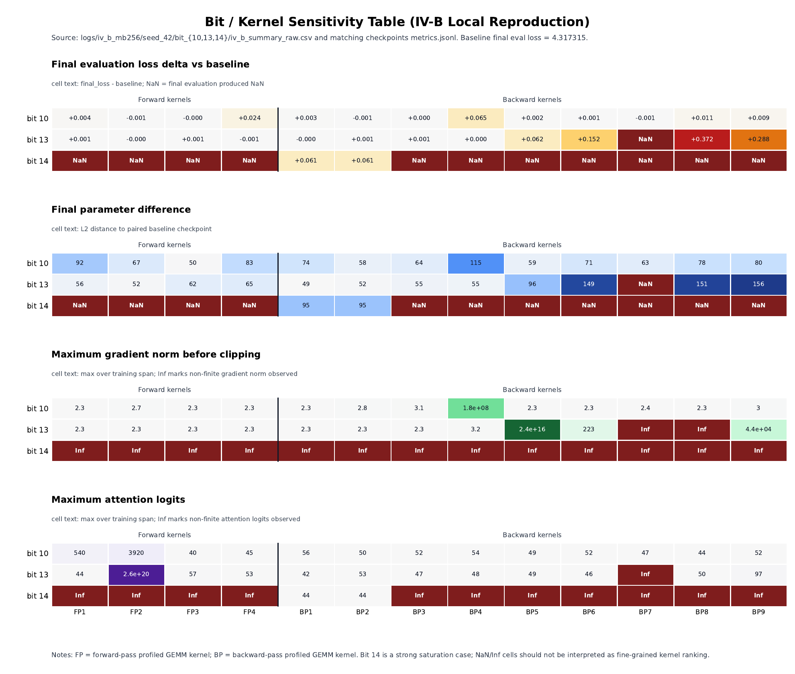
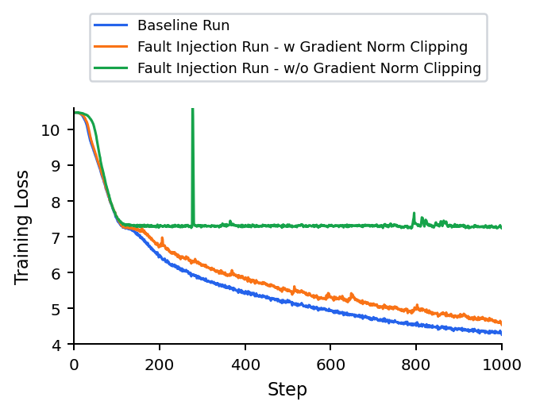
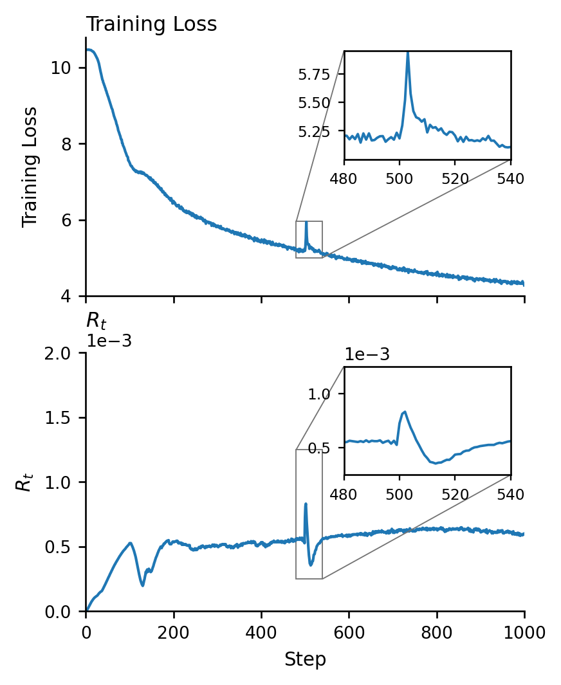

# 《Exploring Silent Data Corruption as a Reliability Challenge in LLM Training》复现实验报告

## 一、环境配置与工程准备

本文复现 *Exploring Silent Data Corruption as a Reliability Challenge in LLM Training* 中关于 LLM 训练静默数据破坏（Silent Data Corruption, SDC）的主要实验。论文使用 NVBit 在 GPU GEMM/HMMA 指令层注入寄存器位翻转，研究故障如何影响 LLaMA 预训练，并评估基于 AdamW 更新幅度的检测与重算恢复机制。

本地复现采用单卡 NVIDIA GeForce RTX 4090，模型为 `llama_60m`（约 58.07M 参数），训练数据为本地 C4 子集，tokenizer 使用本地 T5 tokenizer。主要环境如下：

| 项目 | 配置 |
|---|---|
| GPU | NVIDIA GeForce RTX 4090，24 GB，SM 8.9 |
| OS | Ubuntu 24.04 |
| Python / PyTorch | 3.12.3 / 2.9.0 |
| Transformers / Datasets | 4.56.2 / 4.1.1 |
| NVBit | 1.7.6 |
| Precision | bfloat16 |
| 主实验模型 | `llama_60m` |

相对论文原始代码，本地主要做了工程适配：离线加载 C4 子集和 tokenizer，用本地 `metrics.jsonl` / `summary.json` 替代 wandb；将 NVBit 从 1.7.4 迁移到 1.7.6；优化 NVBit callback，避免未触发注入时仍对每个 kernel launch 执行昂贵控制逻辑；实现 chunked causal LM loss，使 micro batch 256 能在 24 GB 显存下运行；VII-B 中增加 `train_data_repeat`，解决本地 C4 子集不足以支撑 10,000 step 的问题。

冒烟测试均通过。环境稳定性测试中，两次 100-step baseline 在逐步 loss、结构化指标、最终 eval loss 和最终模型权重上完全一致。NVBit 测试中，最小矩阵乘法输出被位翻转显著改变，15-step 训练注入也使最终模型中 58 个张量、68,015 个参数元素发生变化，证明故障注入确实传播到参数更新。

需要注意的是，论文使用 L40S，本地使用 RTX 4090；kernel 数量、kernel 名称和 launch 顺序不同。本机 profiling 得到 4 个 forward kernel（FP1-FP4）和 9 个 backward kernel（BP1-BP9），后续 kernel 标签均以本机 manifest 为准。

## 二、核心算法

论文检测算法的核心思想是：有害 SDC 最终会表现为异常大的 AdamW 参数更新。AdamW 的一阶、二阶动量为：

```text
m_t = beta_1 m_{t-1} + (1 - beta_1) g_t
v_t = beta_2 v_{t-1} + (1 - beta_2) g_t^2
```

忽略 bias correction 和 weight decay 后，参数 `p` 的自适应更新量为：

```text
U_{t,p} = lr * m_{t,p} / (sqrt(v_{t,p}) + eps)
```

论文定义检测统计量 `R_t` 为各参数组更新量 RMS 的最大值：

```text
R_t = max_P sqrt( (1 / |P|) * sum_{p in P} U_{t,p}^2 )
```

再定义更新幅度跳变：

```text
Delta R_t = R_t - R_{t-1}
```

warm-up 阶段的 `Delta R_t` 均值作为基线 `mu_bar`。为减少正常训练波动带来的误报，论文引入 clipping 前全局梯度范数的正跳变：

```text
G_t = max(0, G_t^pre - G_{t-1}^pre)
```

最终判定规则为：

```text
Anomaly <=> Delta R_t > mu_bar / (alpha * sqrt(G_t))
```

其中 `alpha` 控制敏感度，本地检测/重算实验使用 `alpha=0.05`。若 clipping 前梯度范数为 NaN 或 Inf，则直接判定为异常。

检测到 anomaly 后，训练器可开启 recompute：清除当前 step 梯度，关闭 NVBit 注入，重算当前训练 step。如果第一次计算被瞬时故障污染，重算应恢复到接近无故障的更新轨迹。该方法相比 checkpoint rollback 代价更低，因为只重算当前 step。

本地实现与论文有少量差异：`Delta R_t` 使用绝对值；`R_t` 取 max 的粒度是单个参数张量而非严格参数组；只有当梯度范数存在正跳变时才进入阈值判断；前 10 步不检测。这些差异使检测器更像“有害异常更新检测器”，不是“所有注入事件 oracle”。实验中确实存在漏检：轻微位翻转可能改变参数但不触发 detector，forward transient spike 也常不触发 detector。

## 三、完整实验

主实验统一采用 `llama_60m`、seed 42、bfloat16、AdamW、max LR `1e-3`、warmup 1,000 steps、sequence length 256、micro batch 256、gradient accumulation 2、effective batch 512、global gradient clipping 1.0。IV 系列使用 1,000 update steps，paired baseline final eval loss 为 `4.317315101623535`；VII-B 使用 10,000 steps。

### 3.1 IV-A：Bit-Position Sensitivity

IV-A 固定 backward kernel、固定 `TARGET_INSTR=312`、固定 SM0/lane0/register1，只遍历 packed BF16 input register 的 32 个 bit。每组平均每 10 step 注入一次，duration 为 1 step，共 91 次触发。

结果显示，bit 14 和 bit 30 导致最终 eval loss 为 NaN，二者分别对应 packed BF16 low/high half 中同一个 local exponent bit，说明 exponent bit 具有明显强敏感性和 packed symmetry。Mantissa 和 sign bit 未表现出明显 final eval loss 退化。bit 10 没有造成 eval loss 上升，但出现最大有限参数偏移 `76.3788265` 和局部梯度尖峰 `gradient_norm_pre=15.0625`，说明训练轨迹被改变但未转化为最终 loss 退化。

与论文相比，本地只复现了 bit14/30 的 NaN 强阳性，没有复现论文中 bit12/13/28/29/30 等更广泛 NaN 集合，也没有复现 bit10/11/26/27 的稳定 eval loss increase。主要原因是本地 IV-A 使用固定 kernel 和固定 instruction，而论文使用随机 HMMA 指令和随机 iteration；同时本地只做单 seed，硬件和 kernel 集合也不同。

### 3.2 IV-B：Kernel Sensitivity

IV-B 使用本机 profiling 得到的 FP1-FP4、BP1-BP9，共 13 个 kernel；bit 选择 10、13、14；每个 bit 对所有 kernel 各跑一次，共 39 组。与 IV-A 不同，IV-B 使用 `TARGET_INSTR=-1`，覆盖目标 kernel 内全部 HMMA 指令。

最清楚的 kernel sensitivity 出现在 bit13 backward。主要结果如下：

| 组合 | Final eval loss | Delta | Parameter diff | 现象 |
|---|---:|---:|---:|---|
| BP8 + bit13 | 4.6890 | +0.3717 | 151.46 | 最强 finite 退化 |
| BP9 + bit13 | 4.6054 | +0.2881 | 156.09 | 强且无非有限污染 |
| BP6 + bit13 | 4.4691 | +0.1518 | 149.02 | 明显退化 |
| BP7 + bit13 | NaN | NaN | NaN | bit13 下 NaN |
| FP2 + bit13 | 4.3173 | 约 0 | 51.50 | attention logits 达 `2.56e20`，但可恢复 |



本地结果支持论文 IV-B 的定性结论：不同 kernel 对同一 bit 的敏感性差异很大，backward kernel 明显比 forward kernel 更容易造成持久退化。bit14 在大量 kernel 上直接 NaN 饱和，适合证明灾难性传播，但不适合做细粒度 kernel 排序。

需要保守解释 kernel 排序：不同 kernel 的 HMMA 指令数和 launch count 不同，all-HMMA 口径没有严格控制注入剂量。因此 IV-B 只能说明“本机 all-HMMA 口径下 BP8/BP9/BP6 等组合更敏感”，不能推出严格剂量归一化的 kernel 固有全序。不过，剂量差异也不能完全解释结果，例如 BP4 剂量很大但 bit13 几乎无害，而 BP9 剂量较小却是第二强 finite 退化组合。

### 3.3 IV-C / IV-D：Forward 与 Backward 故障传播差异

IV-C/IV-D 复用 IV-B 数据，并补跑 `BP9 + bit13` 的 no-clipping 对照。

Forward fault 主要表现为瞬时 activation/logit 异常。`FP2 + bit13` 的 attention logits 可达到 `2.56e20`，但下一步恢复正常，final eval loss 基本不变，detector 也不响应。本地 forward loss spike 较弱，因此 attention logit 是更可靠的 forward corruption 信号。

Backward fault 更严重，因为它直接污染梯度和 optimizer update。bit13 backward 中 BP8、BP9、BP6 分别造成 `+0.3717`、`+0.2881`、`+0.1518` 的 final eval loss delta；BP7 直接 NaN。

Gradient clipping 对照如下：



| 指标 | Clipped | No-clipping |
|---|---:|---:|
| Final eval loss | 4.6054 | 7.2727 |
| Delta vs baseline | +0.288 | +2.955 |
| Max gradient norm pre/post | 44,032 / 1.016 | 468,992 / 468,992 |
| Nonfinite metrics | 0 | 2 |

clipping 能把梯度尖峰压到约 1.0，使训练继续进行，但仍保留明显 loss bump；no-clipping 在前 100 步内发散并长期停滞在高 loss 区间。这与论文关于 backward fault 和 gradient clipping 的机制结论一致。

### 3.4 IV-E：Spatial Effects

IV-E 固定 `BP9 + bit13`，分别改变 lane 和 SM。Lane sweep 固定 SM0，遍历 lane `0,2,...,30`；SM sweep 固定 lane0，遍历 SM `0,8,...,120`。每部分 16 组，比论文 32+32 缩减一半。

| Sweep | Final eval loss | Delta vs baseline | Parameter diff |
|---|---|---|---|
| Lane | 4.5863 ± 0.0444 | +0.2690 ± 0.0444 | 153.53 ± 1.39 |
| SM | 4.5929 ± 0.0327 | +0.2756 ± 0.0327 | 153.36 ± 1.49 |

所有 lane 和 SM 的退化都在同一量级，没有离群空间位置。论文对应结果为 lane `4.60 ± 0.08`、SM `4.63 ± 0.07`，本地定性和数值量级均对齐，支持“lane/SM 选择不敏感”的结论。

### 3.5 IV-F：Temporal Effects

IV-F 新版实验使用 `BP8 + bit13 + all-HMMA`。旧固定单条 instruction 的 duration 实验只显示弱趋势，因此最终结论以新版 rate/duration 为准。

Rate 实验固定 duration=1，改变注入频率：

| Rate | Final eval loss | Delta | Trigger count | Detected | Parameter diff |
|---|---:|---:|---:|---:|---:|
| every 1 | 7.3782 | +3.0609 | 1000 | 339 | 168.30 |
| every 10 | 4.6890 | +0.3717 | 91 | 74 | 151.46 |
| every 100 | 4.3303 | +0.0130 | 10 | 8 | 109.22 |
| every 1000 | 4.3204 | +0.0031 | 2 | 2 | 55.74 |

final eval loss 随注入频率降低而单调接近 baseline。论文对应结果约为 every-1 `7.38`、every-10 `4.77`、every-100 `4.33`、every-1000 `4.30`，本地曲线形状和主要数值高度一致。

Duration 实验固定 step 500 开始注入，持续 `1/3/5/7/9` 个 update：

| Duration | Final eval loss | Delta | Max grad pre | Parameter diff |
|---:|---:|---:|---:|---:|
| 1 | 4.3204 | +0.0031 | 1296 | 37.50 |
| 3 | 4.3249 | +0.0076 | 1736 | 52.18 |
| 5 | 4.3291 | +0.0118 | 2480 | 56.84 |
| 7 | 4.3423 | +0.0249 | 3616 | 67.59 |
| 9 | 4.3459 | +0.0286 | 11136 | 69.34 |



duration 越长，final eval loss、参数差和梯度尖峰整体越大。duration=3 的时间序列显示，`R_t` 在 step 500 注入窗口内先 spike，training loss 在注入结束后出现 bump，复现了论文 Fig.3 的机制图景。

### 3.6 VII-B / VII-C：Detection + Recomputation

VII-B 论文覆盖 60M、350M、1.3B；本地只做 60M 单 seed。由于论文 bit12/random-kernel 口径在本机退化过弱，本地 VII-B 改用 bit13 + BP8/BP9 + all-HMMA，触发频率 1/100，duration 随机 1-5 steps。10,000-step run 使用 `train_data_repeat=3`，这是与论文全量 C4 数据流的主要偏差。

| 条件 | Final eval loss | Delta | Trigger | Detected | Detection rate | Max grad pre |
|---|---:|---:|---:|---:|---:|---:|
| baseline | 3.5397 | 0 | 0 | n/a | n/a | 2.28 |
| FI | 3.5471 | +0.0074 | 262 | 76 | 29.01% | 17152 |
| FI + recompute | 3.5381 | -0.0015 | 262 | 261 | 99.62% | 288 |

FI 条件下，中途 eval loss 出现明显 spike，例如 step 4000 和 6000 的 delta 约 `+0.09`；final step 部分恢复，因此只看 final delta 会低估中途损害。开启 recompute 后，eval loss 曲线基本贴合 baseline，final delta 为 `-0.0015`，max gradient norm 也从 17152 降到 288，说明检测后重算能有效缓解本地强 target 下的故障影响。

VII-C 比较 fault-free detection-on/off 的训练速度。两组均为 60M、seed 42、step 1-2000，并过滤前 100 step warmup。结果为：detection-on median `1.642826 s/it`，detection-off median `1.674169 s/it`，按脚本口径 overhead 为 `-1.87%`。这没有复现论文约 `+1%` 的正向 slowdown，但说明检测路径开销低于本地单次运行噪声量级，未观察到明显 slowdown。

## 四、结果分析与总结

本地复现实验总体支持论文关于 LLM 训练 SDC 的核心结论。第一，SDC 的影响高度依赖 bit position，BF16 exponent bit 明显更危险；本地 bit14/30 可直接导致 NaN，而 mantissa/sign bit 基本没有 final eval loss 退化。第二，故障所在训练阶段非常关键：forward fault 多表现为可恢复的 attention-logit spike，backward fault 更容易污染梯度、改变 AdamW update，并造成持久 eval loss 退化。第三，gradient clipping 是有效但不充分的防线，它能限制最坏梯度更新，却不能完全恢复已污染轨迹；no-clipping 下训练会快速发散或停滞。第四，fault rate 和 duration 都呈现明确时间累积效应，注入越频繁、持续越久，最终 loss 和参数偏移越大。第五，lane 和 SM 的空间位置在本地未表现出显著敏感性。第六，基于 `R_t` 和梯度跳变的检测配合当前 step recompute，能够把本地 VII-B 的 FI 训练恢复到 baseline 附近。

本地复现也有明确局限。论文使用 L40S 和多模型规模，本地只在 RTX 4090 上完成 60M 主线；多数实验为单 seed；本地 C4 子集较小，VII-B 使用数据重复；IV-A 固定 instruction，与论文随机 HMMA 指令口径不同；IV-B all-HMMA 口径下不同 kernel 注入剂量不完全一致，因此不能推出严格的 kernel 固有全序；VII-B 为获得可观测退化，将 target 从论文 bit12/random-kernel 调整为本机 bit13/BP8/BP9。

因此，本报告的最终结论是：本地实验成功复现并验证了论文的主要机制发现，即 GPU HMMA 层的静默位翻转可以破坏 LLM 训练轨迹，而基于 AdamW 更新幅度的轻量级检测和当前 step 重算可以显著缓解有害故障。但本地结果应视为机制复现和工程验证，不是论文所有绝对数值和全规模实验的完全复制。
